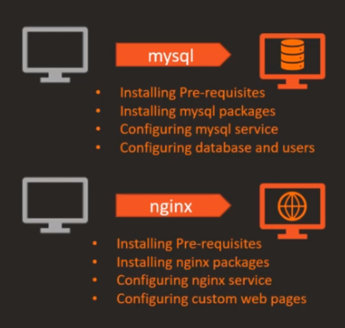
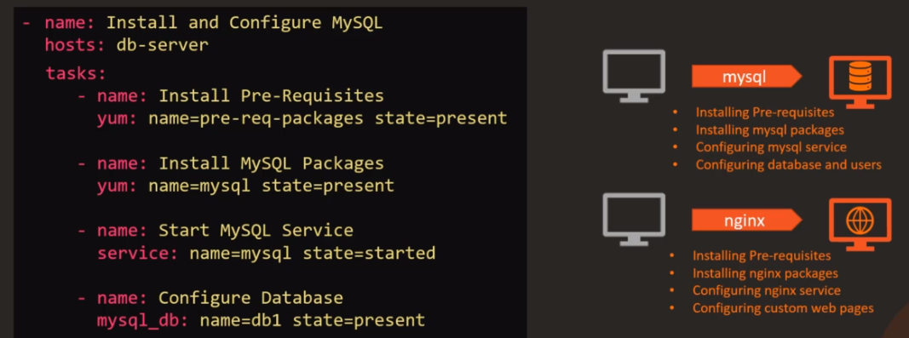
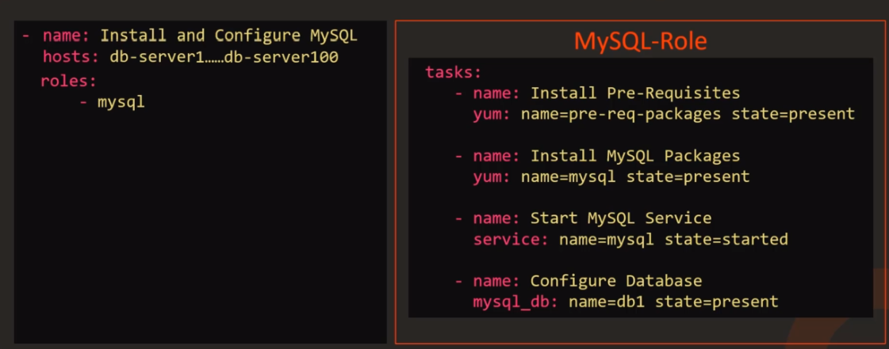
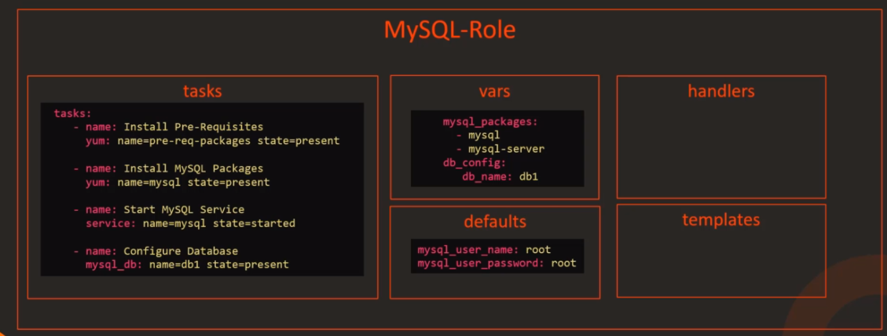
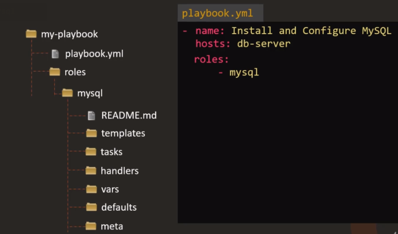
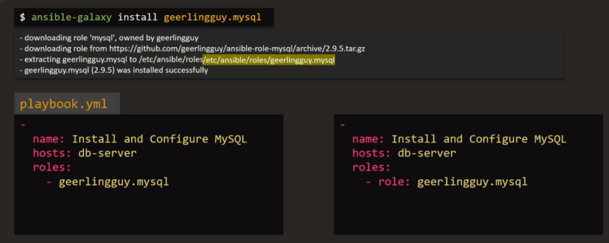
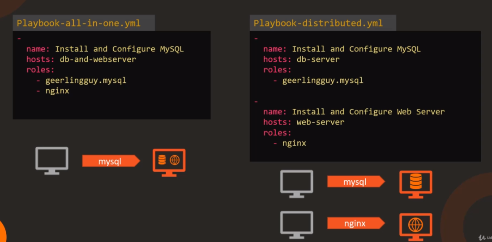

Roles means do a set of tasks to make a box become certain role, like a db server or web server.


There is not many reusability for playbooks


However, you can package it, so it can be used by 1 server, or 100 servers


Meanwhile, roles define a set of best practices for organizing your code:


Also, roles can be shared with communities. [ansible galaxy](https://galaxy.ansible.com/) is one of those

To use roles you defined, there are 2 ways:

1. use folder structure:

When Ansible runs, it looks for the `mysql` role under the `roles` directory



2. There is a common directory designated for roles on your system, `/etc/ansible/roles`

This default location can be changed from `/etc/ansible/ansible.cfg`

```
roles_path = /etc/ansible/roles
```

You can use ansible-galaxy cli to install roles

```
ansible-galaxy install geerlingguy.mysql
```

It will be downloaded, and extracted into your /etc/ansible/roles folder



Benefits:

- Easy to reuse and share
  
