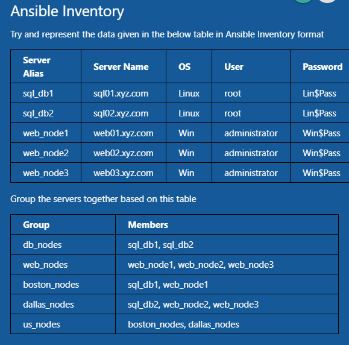

Ansible works against multiple managed nodes or “hosts” in your infrastructure at the same time, using a list or group of lists know as inventory. Once your inventory is defined, you use patterns to select the hosts or groups you want Ansible to run against.

The default location for inventory is a file called `/etc/ansible/hosts`. You can specify a different inventory file at the command line using the `-i <path>` option.

- ansible_host
- ansible_connection for Linux is `ssh`, for Windows is `winrm`
- ansible_user
- ansible_ssh_pass (linux)
- ansible_password (Windows)

An sample example to work with a list of hosts by using inventory file

```
[targets]
target1 ansible_host=192.168.20.26 ansible_ssh_pass=osboxes.org
target2 ansible_host=192.168.20.27 ansible_ssh_pass=osboxes.org

```

then

```sh
ansible targets -m ping -i inventory.txt
```

This ad-hoc operation will be executed on group level.

By default, ansible has a group called `all`, includes all machines in the inventory file.

And result

```
target1 | SUCCESS => {
    "ansible_facts": {
        "discovered_interpreter_python": "/usr/bin/python3"
    },
    "changed": false,
    "ping": "pong"
}
target2 | SUCCESS => {
    "ansible_facts": {
        "discovered_interpreter_python": "/usr/bin/python3"
    },
    "changed": false,
    "ping": "pong"
}

```

Coding Exercise - Ansible Inventory

[here](https://kodekloud.com/p/ansible-practice-test/?scenario=questions_ansible_inventory)



```ansible
[db_nodes]
sql_db1 ansible_host=sql01.xyz.com ansible_connection=ssh ansible_user=root ansible_ssh_pass=Lin$Pass
sql_db2 ansible_host=sql02.xyz.com ansible_connection=ssh ansible_user=root ansible_ssh_pass=Lin$Pass

[web_nodes]
web_node1 ansible_host=web01.xyz.com ansible_connection=winrm ansible_user=administrator ansible_password=Win$Pass
web_node2 ansible_host=web02.xyz.com ansible_connection=winrm ansible_user=administrator ansible_password=Win$Pass
web_node3 ansible_host=web03.xyz.com ansible_connection=winrm ansible_user=administrator ansible_password=Win$Pass

[boston_nodes]
sql_db1
web_node1

[dallas_nodes]
sql_db2
web_node2
web_node3

[us_nodes:children]
boston_nodes
dallas_nodes
```
