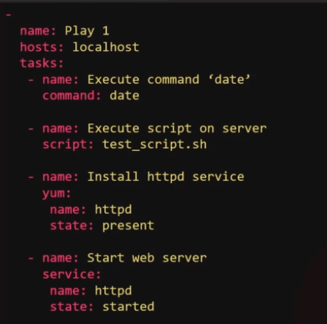
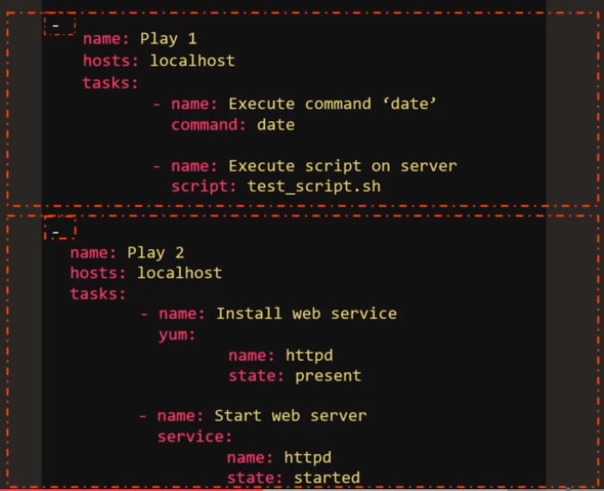
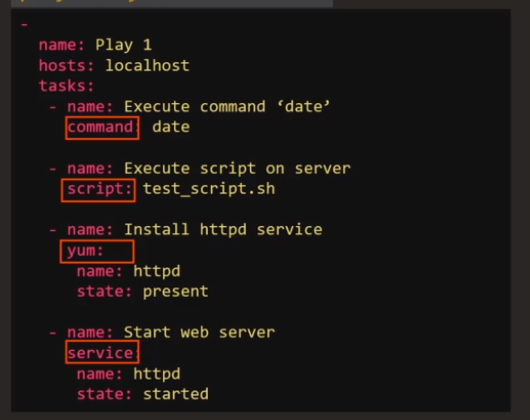
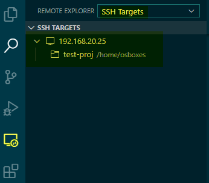
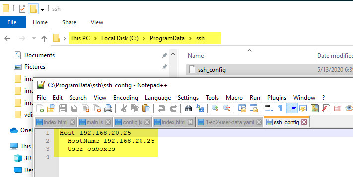
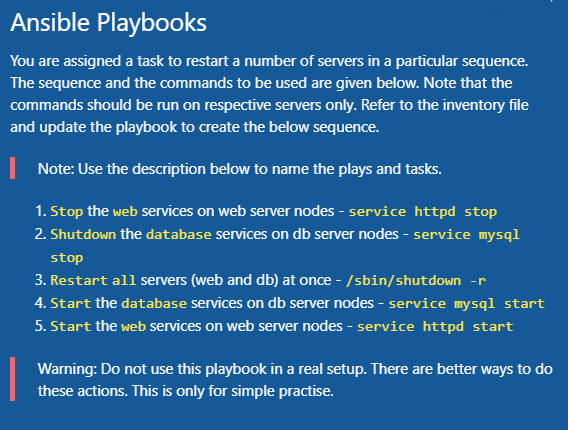

### About Playbooks

`Playbooks` are a completely different way to use ansible than in ad-hoc task execution mode, and are particularly powerful.

Simply put, `playbooks` are the basis for a really simple configuration management and multi-machine deployment system, unlike any that already exist, and one that is very well suited to deploying complex applications.

A `playbook` is a single Yammer file containing a set of plays a play defines a set of activities to be run on a single or a group of hosts.

A `task` is a single action to be performed on a host.

- Playbook - A Single YAML file
  - Play - Defines a set of activities (tasks) to be run on hosts
    - Task - An action to be performed on the host
      - Execute a command
      - Run a script
      - Install a package
      - Shutdown/Restart

An example:



Or you can group them into different `plays`



- hosts: on which host(s) this operation will be run on, It has to be defined in inventory file before use.

#### modules

Modules (also referred to as “task plugins” or “library plugins”) are discrete units of code that can be used from the command line or in a playbook task. Ansible executes each module, usually on the remote target node, and collects return values.



Some common used:

- command – Execute commands on targets [example](https://docs.ansible.com/ansible/latest/modules/command_module.html#examples)

- script - script – Runs a local script on a remote node after transferring it [example](https://docs.ansible.com/ansible/latest/modules/script_module.html#examples)

- shell – Execute shell commands on targets [example](https://docs.ansible.com/ansible/latest/modules/shell_module.html#examples)

#### run

syntax:

```
ansible-playbook <playbook_file_name> -i <inventory_file_name>
```

First playbook file:

```yml
- name: Test connection to target servers # name of the play
  hosts: all
  tasks:
    - name: Ping test # name of the task
      ping: # module
```

run

```
ansible-playbook playbook-pingtest.yml -i inventory.txt

```

```sh
osboxes@ansiblecontroller:~/test-proj$ ansible-playbook playbook-pingtest.yml -i inventory.txt

PLAY [Test connection to target servers] ***************************************

TASK [Gathering Facts] *********************************************************
ok: [target2]
ok: [target1]

TASK [Ping test task] **********************************************************
ok: [target2]
ok: [target1]

PLAY RECAP *********************************************************************
target1                    : ok=2    changed=0    unreachable=0    failed=0    skipped=0    rescued=0    ignored=0
target2                    : ok=2    changed=0    unreachable=0    failed=0    skipped=0    rescued=0    ignored=0

```

#### Using `Remote - SSH` plugin in VSCode for development

You don't have to login to remote machine, then use vim or nano for development. Simply install `Remote - SSH` extension.

And you will see a `Remote Explorer` icon on the left. Click it, and select `SSH Targets` from left, add you machine in it, and choose a locate to save your configurations.





Now when you are connected to the remote machine via ssh, you can read but you can't modify its content. when you try to save, you will get an error `Failed to save file, EACCESS permision denied`. You have to change the folder permissions by running something like

```sh
sudo chown 777 ~/test-proj

or

sudo chown -R osboxes ~/test-proj

```

#### Practice

Access the Labs for Playbooks [here](https://kodekloud.com/p/ansible-practice-test/?scenario=questions_ansible_playbook)

A playbook with multiple plays (steps)



```sh
-
    name: 'Stop the web services on web server nodes'
    hosts: web_nodes
    tasks:
        -
            name: 'Stop the web services on web server nodes'
            command: 'service httpd stop'

-
    name: 'Shutdown the database services on db server nodes'
    hosts: db_nodes
    tasks:
        -
            name: 'Shutdown the database services on db server nodes'
            command: 'service mysql stop'

-
    name: 'Restart all servers (web and db) at once'
    hosts: all_nodes
    tasks:
        -
            name: 'Restart all servers (web and db) at once'
            command: '/sbin/shutdown -r'

-
    name: 'Start the database services on db server nodes'
    hosts: db_nodes
    tasks:
        -
            name: 'Start the database services on db server nodes'
            command: 'service mysql start'

-
    name: 'Start the web services on web server nodes'
    hosts: web_nodes
    tasks:
        -
            name: 'Start the web services on web server nodes'
            command: 'service httpd start'
```
