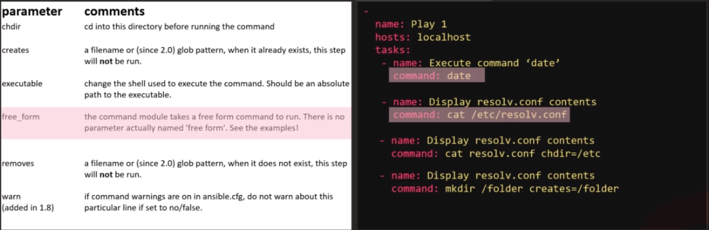
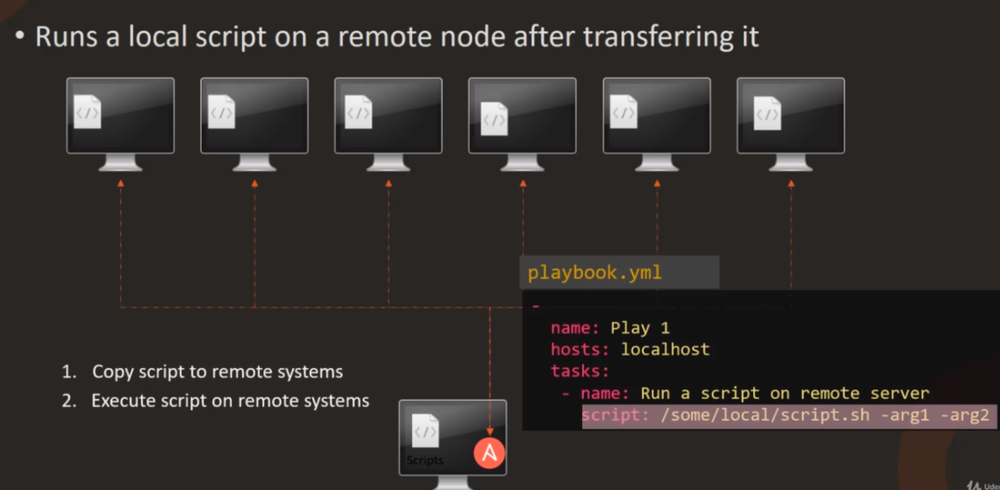
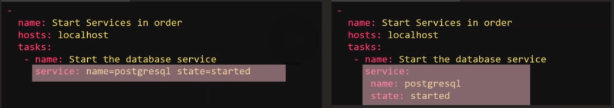
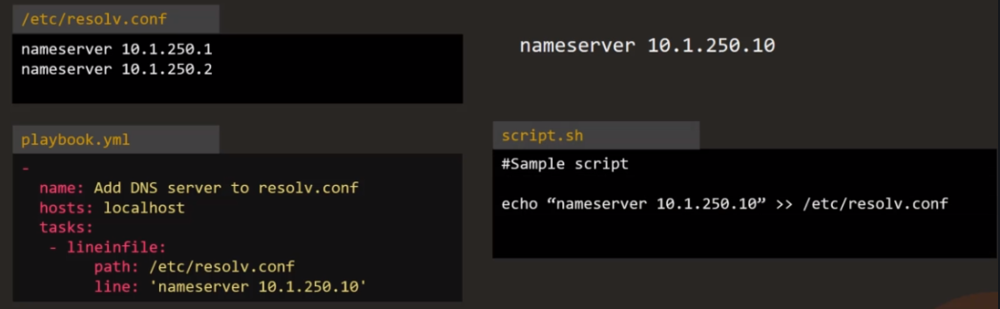

There are lots of Ansible modules [Module Index](https://docs.ansible.com/ansible/latest/modules/modules_by_category.html)

- Cloud modules
- Clustering modules
- Commands modules
- Crypto modules
- Database modules
- Files modules
- Identity modules
- Inventory modules
- Messaging modules
- Monitoring modules
- Net Tools modules
- Network modules
- Notification modules
- Packaging modules
- Remote Management modules
- Source Control modules
- Storage modules
- System modules
- Utilities modules
- Web Infrastructure modules
- Windows modules

Some examples:

- command: executes a command on a remote node



Note: free_form means this `command` module accepts free_form of parameter, it can be `date` or `cat /etc/resolve.conf` or any form of string. Unlike some module, it has predefined format, for example `opy: src=/source_file dest=/destination`.

- script: Runs a local script on a remote node after transferring it



- service: start, stop, restart services



Ansible use `started` not `start`, is because Ansible ensure service is `started`. If it is not already started, start it, if it is already started, do nothing.

- lineinfile: search for a line in a file, and replace it or add it of it doesn't exist.



Benefit of using lineinfile, not sh is, if it is run for multiple times, it will ensure the line will be added only ONCE.

#### Coding Exercise

Access the labs for Ansible Modules [here](https://kodekloud.com/p/ansible-practice-test/?scenario=questions_ansible_modules)

1. Update the playbook with a play to Execute a script on all web server nodes. The script is located at /tmp/install_script.sh

```sh
-
  name:  Execute a script on all web server nodes
  hosts: web_nodes
  tasks:
    - name: Execute a script on all web server nodes
      script: /tmp/install_script.sh
```

2. Update the playbook to add a new task to start httpd services on all web nodes

```sh
-
    name: 'Execute a script on all web server nodes'
    hosts: web_nodes
    tasks:
        -
            name: 'Execute a script on all web server nodes'
            script: /tmp/install_script.sh
        -
            name:  start httpd services on all web nodes
            service:
                name: web_nodes
                state: started
```

3. Update the playbook to add a new task in the beginning to add an entry into /etc/resolv.conf file for hosts. The line to be added is nameserver 10.1.250.10

Note: The new task must be executed first, so place it accordingly.

```sh
-
    name: 'Execute a script on all web server nodes'
    hosts: web_nodes
    tasks:
        -
            name:  add an entry into /etc/resolv.conf file for hosts.
            lineinfile:
                path: /etc/resolv.conf
                line: nameserver 10.1.250.10
        -
            name: 'Execute a script'
            script: /tmp/install_script.sh
        -
            name: 'Start httpd service'
            service:
                name: httpd
                state: present

```

4. Update the playbook to add a new task at second position (right after adding entry to resolv.conf) to create a new web user.

Use the user module for this. User details to be used are given below:
Username: web_user
uid: 1040
group: developers

```sh
-
    name: 'Execute a script on all web server nodes and start httpd service'
    hosts: web_nodes
    tasks:
        -
            name: 'Update entry into /etc/resolv.conf'
            lineinfile:
                path: /etc/resolv.conf
                line: 'nameserver 10.1.250.10'
        -
            name: create a new web user
            user:
                name: web_user
                uid: 1040
                group: developers

        -
            name: 'Execute a script'
            script: /tmp/install_script.sh
        -
            name: 'Start httpd service'
            service:
                name: httpd
                state: present

```
