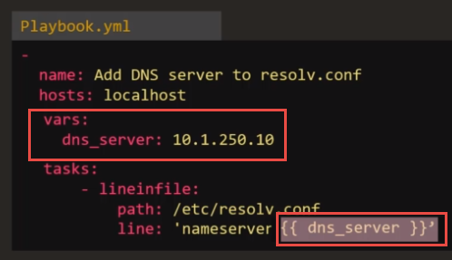
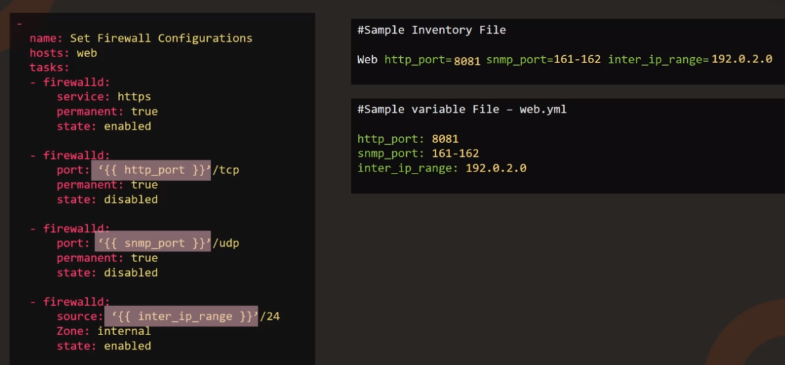
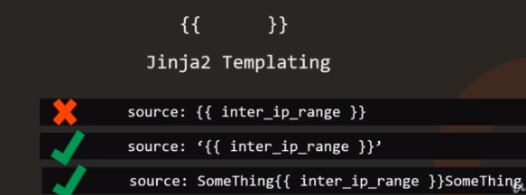

Variables: Store information that varies with each host



As you can see, using variables is using `Jinja2 Templating`, which `{{ var_name }}`



You can put variables in the playbook file, in inventory file, so in a separate variable file



#### Coding Exercise: Ansible Variables

Access the coding exercises [here](https://kodekloud.com/p/ansible-practice-test/?scenario=questions_ansible_variables)

1. The playbook is used to update name server entry into resolv.conf file on localhost. The name server information is also updated in the inventory file as a variable nameserver_ip. Refer to the inventory file.

Replace the ip of the name server in this playbook to use the value from the inventory file, so that in the future if you had to make any changes you simply have to update the inventory file.

playbook.yaml

```yaml
- name: "Update nameserver entry into resolv.conf file on localhost"
  hosts: localhost
  tasks:
    - name: "Update nameserver entry into resolv.conf file"
      lineinfile:
        path: /etc/resolv.conf
        line: "nameserver {{ nameserver_ip }}"
```

inventory

```
# Sample Inventory File

localhost ansible_connection=localhost nameserver_ip=10.1.250.10
```

2. We have added a new task to disable SNMP port in the playbook. However the port is hardcoded in the playbook. Update the inventory file to add a new variable snmp_port and assign the value used here. Then update the playbook to use value from the variable.

Remember to use curly braces around the variable name.

playbook.yaml

```yaml
- name: "Update nameserver entry into resolv.conf file on localhost"
  hosts: localhost
  tasks:
    - name: "Update nameserver entry into resolv.conf file"
      lineinfile:
        path: /etc/resolv.conf
        line: "nameserver {{ nameserver_ip }}"
    - name: "Disable SNMP Port"
      firewalld:
        port: "{{ snmp_port }}"
        permanent: true
        state: disabled
```

inventory

```
# Sample Inventory File

localhost ansible_connection=localhost nameserver_ip=10.1.250.10 snmp_port=160-161
```

3. We are printing some personal information to the screen. We would like to move the car_model, country_name and title to a variable defined at the play level.

Create three new variables (car_model, country_name and title) under the play and move the values over. Use the variables in the task.

playbook.yaml

```yaml
- name: "Update nameserver entry into resolv.conf file on localhost"
  hosts: localhost
  vars:
    car_model: BMW M3
    country_name: USA
    title: Systems Engineer
  tasks:
    - name: "Print my car model"
      command: 'echo "My car''s model is {{ car_model }}"'
    - name: "Print my country"
      command: 'echo "I live in the {{ country_name }}"'
    - name: "Print my title"
      command: 'echo "I work as a {{ title }}"'
```
