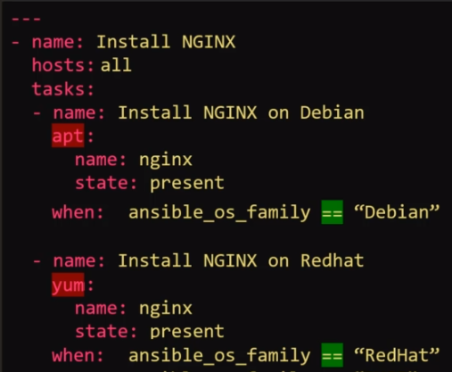
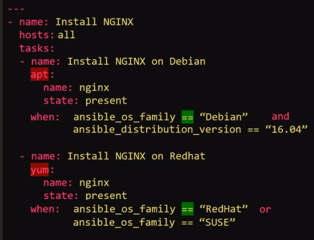

Without conditionals we have 2 playbooks


with conditionals they can be merged into 1

**Conditional - when**


**Operator - or**


**Operator - and**


**Conditional in Loops**


**Conditional and Register directive**


#### Coding Exercise: Ansible Conditionals

Access the labs for Ansible Conditionals [here](https://kodekloud.com/p/ansible-practice-test/?scenario=questions_ansible_conditionals)

1. The given playbook attempts to start mysql service on all_servers. Use the `when` condition to run this task if the host (ansible_host) is the database server.

Refer to the inventory file to identify the name of the database server.

```yaml
- name: "Execute a script on all web server nodes"
  hosts: all_servers
  tasks:
    - service: "name=mysql state=started"
      when: ansible_host  == "server4.company.com"
```

2.  The playbook has a variable defined - `age`. The two tasks attempt to print if I am a child or an Adult. Use the when conditional to print if I am a child or an Adult based on weather my age is < 18 (child) or >= 18 (Adult).

```yml
- name: "Am I an Adult or a Child?"
  hosts: localhost
  vars:
    age: 25
  tasks:
    - command: 'echo "I am a Child"'
      when: age < 18
    - command: 'echo "I am an Adult"'
      when: age >= 18
```

3. The given playbook attempts to add an entry into the /etc/resolv.conf file for nameserver.

First, we run a command using the `shell` module to get the contents of /etc/resolv.conf file and then we add a new line containing the name server data into the file. However, when this playbook is run multiple times, it keeps adding new entries of same line into the resolv.conf file.

Add a register directive to store the output of the first command to variable command_output

Then add a conditional to the second command to check if the output contains the name server (10.0.250.10) already. Use command_output.stdout.find(<IP>) == -1

Note: A better way to do this would be to use the lineinfile module. This is just for practice.

Note: shell and command modules are similar in that they are used to execute a command on the system. However shell executes the command inside a shell giving us access to environment variables and redirection using >>

```yaml
- name: "Add name server entry if not already entered"
  hosts: localhost
  tasks:
    - shell: "cat /etc/resolv.conf"
      register: command_output
    - shell: 'echo "nameserver 10.0.250.10" >> /etc/resolv.conf'
      when: command_output.stdout.find('10.0.250.10') == -1
```
