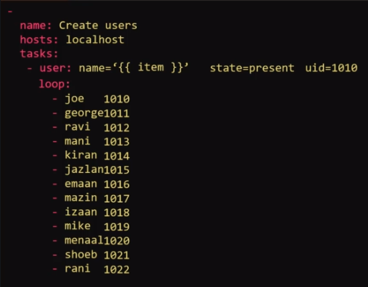
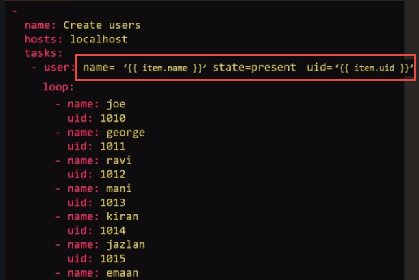
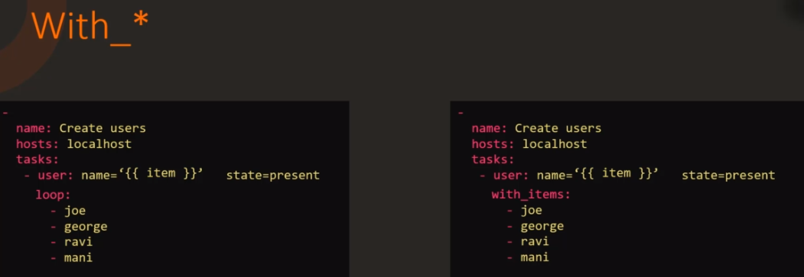
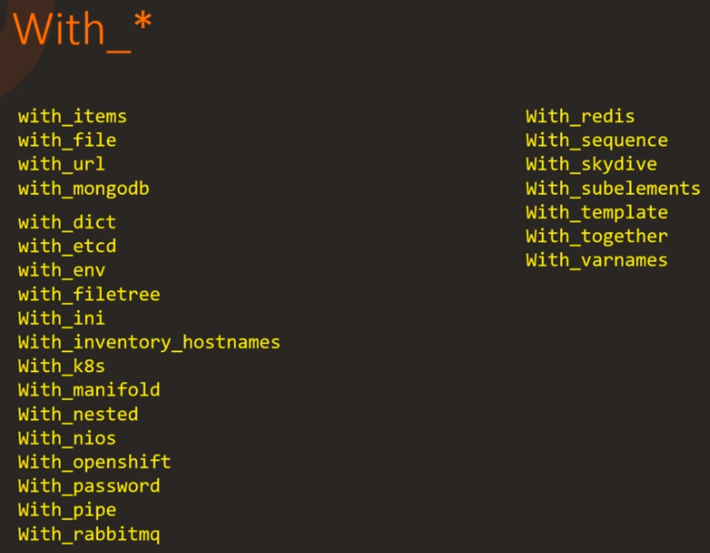

Loops

Each element in a loop listing will be saved into a special variable `item`



If element is a dictionary:



Note: `loops` directive is newly added, and `with_items` directive was used in older versions of ansible. They are basically doing the same thing.

Some other `With_*` directives


And there are many more...


#### Coding Exercise: Ansible Loops

Access the labs [here](https://kodekloud.com/p/ansible-practice-test/?scenario=questions_ansible_loops)

1. The playbook currently runs an echo command to print a fruit name. Apply a loop directive (with_items) to the task to print all fruits defined in the fruits variable.

```yaml
- name: "Print list of fruits"
  hosts: localhost
  vars:
    fruits:
      - Apple
      - Banana
      - Grapes
      - Orange
  tasks:
    - command: 'echo "{{ item }}"'
      with_items: "{{ fruits }}"
```

2. To a more realistic use case. We are attempting to install multiple packages using yum module.The current playbook installs only a single package.

```yaml
- name: "Install required packages"
  hosts: localhost
  vars:
    packages:
      - httpd
      - binutils
      - glibc
      - ksh
      - libaio
      - libXext
      - gcc
      - make
      - sysstat
      - unixODBC
      - mongodb
      - nodejs
      - grunt
  tasks:
    - yum: "name={{ item }} state=present"
      with_items: "{{ packages }}"
```
